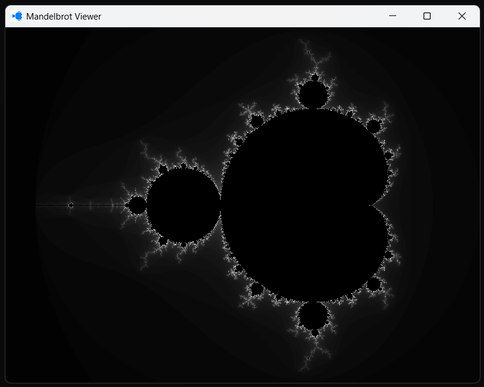
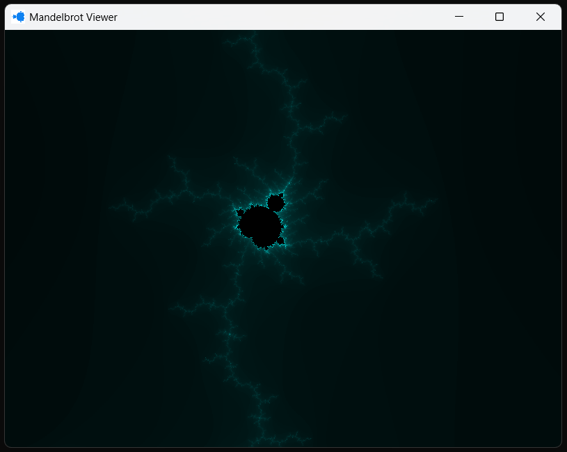
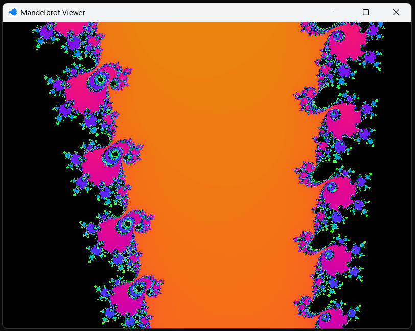
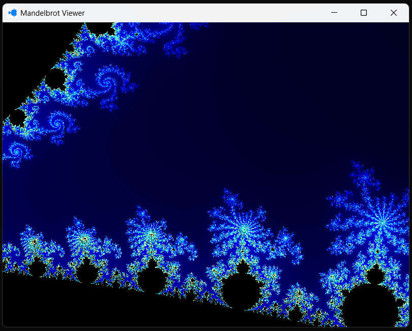
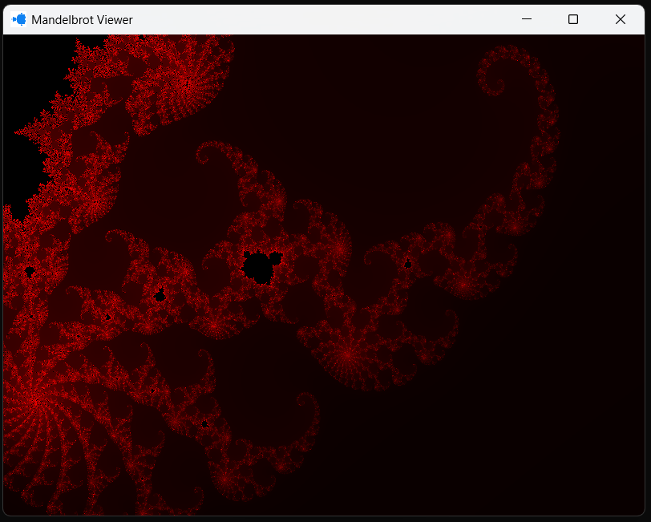
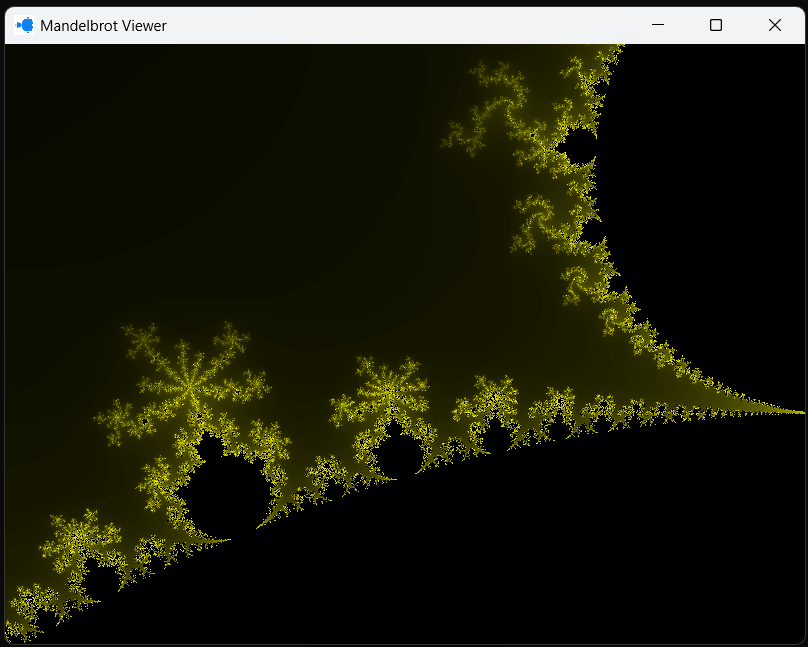
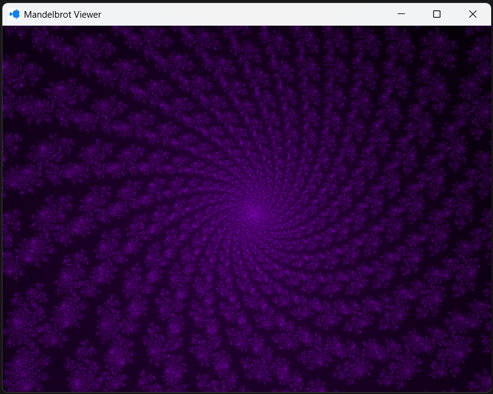
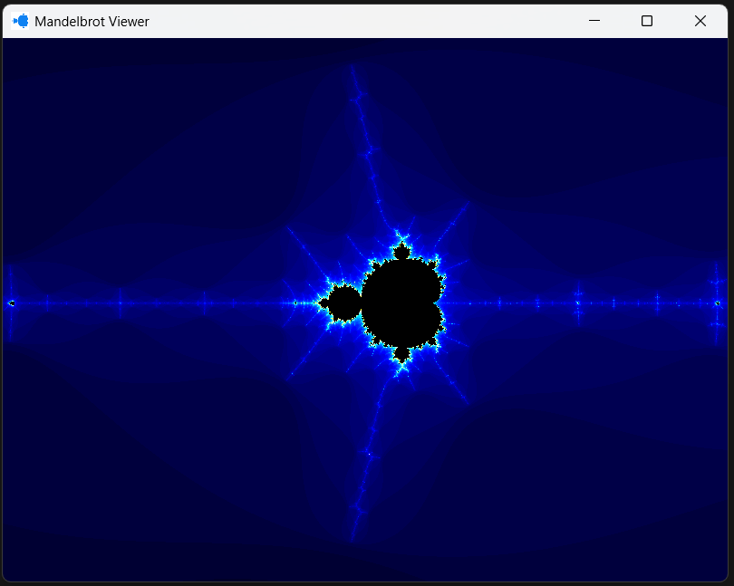
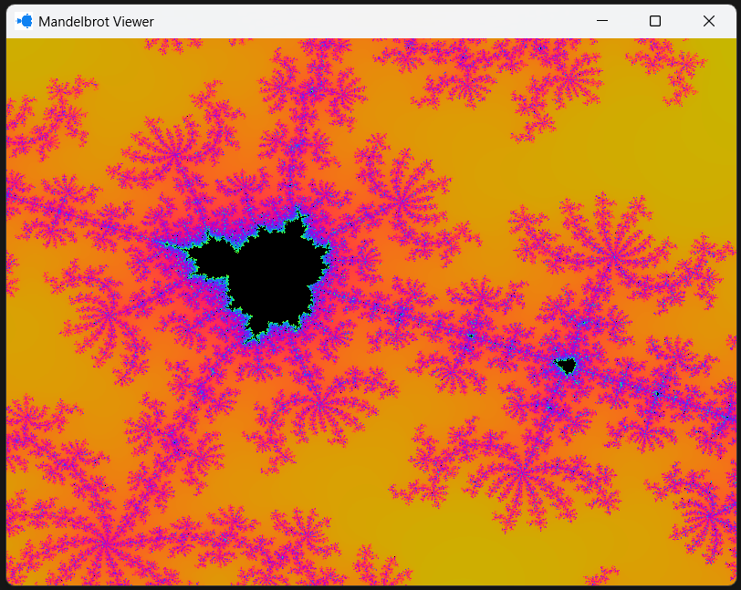

# Mandelbrot Viewer
A Mandelbrot set viewer written in C++ using [SFML 3](https://www.sfml-dev.org/)

## Features
- Multithreading
- Color themes
- Adjustable view
- Adjustable max iterations

## Controls
| Input | Output |
|------|-----|
| Left Click | Two clicks define a zoom rectangle |
| Right Click | Zoom out |
| C | Show controls |
| R | Reset view |
| F | Toggle fullscreen |
| T | Redraw and time current frame |
| Z | Undo first click |
| S | Correct aspect ratio |
| - / = | Decrease and increase max iterations |
| WASD | Move around |
| 1 to 0 | Change color scheme |
| ESC | Quit |

## Dependencies
- C++
- SFML 3
- CMake

## Build and Compile
`cmake -S . -B build`  
`cmake --build build`

## Example Screenshots

